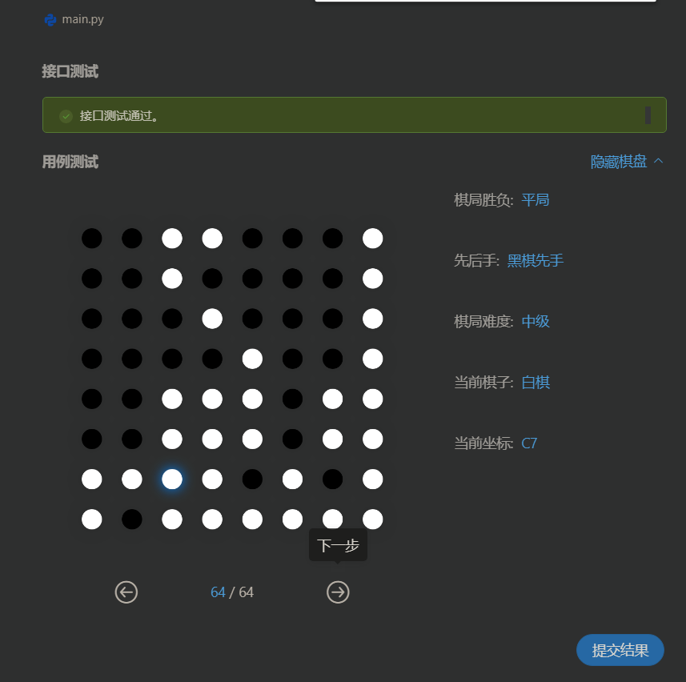

# AI-for-Othello
## something about Othello

### 黑白棋规则

传统的黑白棋棋盘由 8 x 8 方格组成。开局时，棋盘中央的4格先置黑白相间的4颗棋子 (详见下图)，并由**黑子先行**。

首步由黑子先下；下子时；新子必须与棋盘上任一己方棋子形成一条或多条 (横、竖、斜) 直线，并夹着对方棋子；由新子及旧子连成的直线之间，必须存有一颗或以上对方的棋子。如图，黑子开局时之可行棋步有以下4格:

双方交替下子；倘若任何一方没有棋步可行，则其必须将下子权利相认予对手；另在双方均无子可下的情况下，游戏自动结束。

游戏结束后，拥子较多一方为胜；倘若双方棋数相同的，则为和局。

### 黑白棋基本策略

#### 占角子及固定子

> 按照黑白棋的玩法，其中一子落在佔角处的，该棋子将无法再被翻转。

#### 危险方块

在棋盘上，棋子下在某些方块中，比起其它下子位置更为安全。档游戏开始，一般建议尽量将棋子下于棋盘 4 x 4格的中心范围内 (下图以半透明白子显示)；且应避免将棋子下于靠近边角的方块内(下图以半透明黑子显示)，棋子落于靠近边角的方块中，会让对手更容易占据边角相邻的位置。

#### 行动力

初学者的普遍错误一般在开盘后<u>不断占子</u>，但在黑白棋中这并<u>不是一个好的策略</u>。**较好的策略为专注于限制对方的落子选项，而交易进入这种策略的方法为占少子**。在下面的例子中，白子虽然只有一颗棋子，但其可轻而易具的在4步内赢得整盘棋。

from : https://www.eothello.com/

较为强悍的othello AI: https://playpager.com/play-reversi/index.html

## AI for Othello Coding

### search before Coding：

- [Unispac](https://github.com/Unispac)/**[Alpha-Othello](https://github.com/Unispac/Alpha-Othello)**——浙大学长的（集成了很多Agent）
- [YuMu0](https://github.com/YuMu0)/**[ReversiAI](https://github.com/YuMu0/ReversiAI)**——博弈树、α-β剪枝（有UI；单文件，结构有点差）
- [1011497938](https://github.com/1011497938)/**[Othello](https://github.com/1011497938/Othello)**——MCTS、Q-learning（在浙大学长的基础上增加了几类agent）
- [im0qianqian](https://github.com/im0qianqian)/**[Reversi-based-RL](https://github.com/im0qianqian/Reversi-based-RL)**——毕设，文档说明：https://www.dreamwings.cn/reversi/3013.html
- [faded53222](https://github.com/faded53222)/**[Othello](https://github.com/faded53222/Othello)**——B站用户

---

## MyCode——MCTS

> 部分借鉴了[tic-tac-toe井字棋MCTS](https://github.com/int8/monte-carlo-tree-search)的代码框架

MSCT-target： Start：从可行位置进行树探索 -> End：一个价值比较高的action

<mark>代码中容易忘记的是，所有的board在rollout的时候都应该保存的临时变量，即确保node的self.board是不变的；board设计的时候，不要限定死color（move），这样可选择性更好</mark>

虽然加上了corner，但是对站中级还是赢少输多， 看了下比赛棋盘，发现对corner的限制并不奏效，希望能找到更好的方法吧。

### 战力

#### basic

##### 初级WIN

##### 中级LOSS：

#### 加上corner：

##### 中级tie

##### 中级WIN

#### 高级：

## 时间安排

2020/12/2 上网冲浪，搜集相关资料，看了[Unispac](https://github.com/Unispac)/**[Alpha-Othello](https://github.com/Unispac/Alpha-Othello)**的设计报告。

2020/12/4 结合[代码](https://github.com/1011497938/Othello)和[视频]([AI如何下棋？直观了解蒙特卡洛树搜索MCTS！！！](https://www.bilibili.com/video/BV1JD4y1Q7mV?from=search&seid=6045698802301050730)理了遍MCTS的原理， 列出了大致的框架， 明天开始编写逻辑代码。